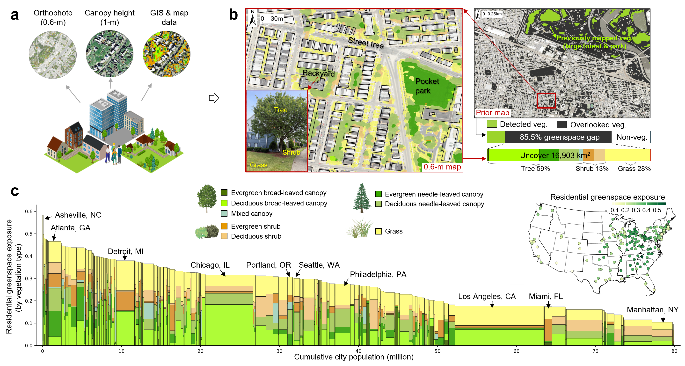

# Overlooked Urban Vegetation Reveals Historically Rooted Disparities in Greenspace Types and Services across U.S. Cities
<!-- **Author: Zhuohong Li, Tate Commission, Xiaoguo Geng, Shaoyu Feng, Rongfei Su, Hanshi Chen, Zach Calhoun, David Carlson, and Tong Qiu** -->
<!-- **Affiliation: Nicholas School of the Environment, Duke University** -->

In this study, we present the first 0.6-m map of **eight greenspace functional types** across **212 U.S. city cores** covered by 1930s Home Owners' Loan Corporation (HOLC) residential security maps. Our sub-meter product resolves **16,903 km² (85.5%)** of urban vegetation missed by the conventional 30-m NLCD, and we use it to quantify **population-weighted Residential Greenspace Exposure (RGE)**. Linking RGE to historical redlining grades, contemporary income and education, and two regulating ecosystem services (**PM2.5 mitigation** and **cooling**), we show that greenspace disparity extends beyond amount to functional composition, with the largest and most persistent deficits in **trees**.



* If you have any questions or requests, contact us at zhuohong.li@duke.edu (Zhuohong Li, PhD.) or tong.qiu@duke.edu (Tong Qiu, PhD.).

Our previous works:
* [**SinoBF-1**](https://www.nature.com/articles/s41467-026-69589-5): accepted by Nature Communications 2026, satellite mapping of every building's function in urban China. [**Code**](https://github.com/LiZhuoHong/SinoBF-1/)
* [**Paraformer**](https://openaccess.thecvf.com/content/CVPR2024/papers/Li_Learning_without_Exact_Guidance_Updating_Large-scale_High-resolution_Land_Cover_Maps_CVPR_2024_paper.pdf): accepted by CVPR 2024 (highlight), weakly supervised framework for high-resolution mapping. [**Code**](https://github.com/LiZhuoHong/Paraformer/)
* [**SinoLC-1**](https://essd.copernicus.org/articles/15/4749/2023/): accepted by ESSD 2023, the first 1-m resolution national-scale land-cover map of China. [**Data**](https://zenodo.org/record/7821068)

This repository contains the complete protocol for reproducing the analysis pipeline behind the figures: (1) Residential Greenspace Exposure, (2) redlining-grade disparity, (3) income and education gradients, (4) PM2.5 mitigation, and (5) cooling.

## The sub-meter greenspace functional map
### The complete map product and user guide are released at: [**Zenodo (accession to be updated)**](https://zenodo.org/)


The product covers **212 U.S. city cores** and distinguishes eight greenspace functional types following the IGBP / FAO land-cover conventions:

| Pixel value | Code | Functional type |
|:-----------:|:----:|:----------------|
| 2  | EBF | Evergreen broad-leaved canopy |
| 4  | DBF | Deciduous broad-leaved canopy |
| 6  | ENF | Evergreen needle-leaved canopy |
| 8  | DNF | Deciduous needle-leaved canopy |
| 10 | MF  | Mixed canopy |
| 12 | ES  | Evergreen shrub |
| 13 | DS  | Deciduous shrub |
| 14 | Grass | Grass |

For growth-form analyses these are grouped into **tree** (2, 4, 6, 8, 10), **shrub** (12, 13), and **grass** (14).

The map was produced with our weakly-supervised deep-learning model **Paraformer** ([**code**](https://github.com/LiZhuoHong/Paraformer)), which learns sub-meter functional types from coarse, mismatched labels by fusing a resolution-preserving CNN branch with a Vision Transformer branch. The analysis scripts in this repository take the resulting 0.6-m greenspace maps as input.

The original data sources required to reproduce the analysis are:
[**NAIP 0.6-m imagery**](https://naip-usdaonline.hub.arcgis.com),
[**1-m canopy height (Meta / WRI)**](https://registry.opendata.aws/dataforgood-fb-forests),
[**GLC_FCS10 training labels**](https://doi.org/10.5281/zenodo.14729665),
[**GlobalHighPM2.5 (Wei et al.)**](https://doi.org/10.5281/zenodo.10800980),
[**street-tree inventory (McCoy et al.)**](https://doi.org/10.5061/dryad.2jm63xsrf),
[**ParkServe park boundaries**](https://www.tpl.org/park-data-downloads),
[**GBIF species occurrences**](https://www.gbif.org/occurrence/download),
[**USA Structures footprints**](https://gis-fema.hub.arcgis.com/pages/usa-structures),
[**U.S. Census / ACS**](https://data.census.gov),
[**HOLC redlining (Mapping Inequality)**](https://dsl.richmond.edu/panorama/redlining), and
[**urban temperature (heat.gov)**](https://heat.gov/urban-heat-islands-mapping-campaign-program/).

## Analysis pipeline overview

| Assessment dimension | Indicators | Explanation |
|:---|:---|:---|
| Residential greenspace exposure | RGE to eight functional types; tree / shrub / grass | Population-weighted greenspace within a 1-km residential buffer, aggregated from block to tract. Scripts in `./step1_greenspace_exposure`. Corresponds to **Figure 1**. |
| Historical redlining disparity | Kendall's tau-b; Cliff's delta (A vs D) | Rank association between HOLC grade (A->D) and RGE per city and growth form, with Benjamini-Hochberg FDR. Scripts in `./step2_exposure_by_grade`. Corresponds to **Figure 2**. |
| Socioeconomic gradients | RGE by income bracket and education interval, stratified by grade | Distribution of RGE across contemporary income and education within each HOLC grade. Scripts in `./step3_income_education_disparity`. Corresponds to **Figure 3** (and joint income-education patterns, **Figure 4**). |
| PM2.5 mitigation | Resident-level PM2.5 mitigation (RPM) | Per-city removal coefficients applied to greenspace composition, population-weighted to residents. Scripts in `./step4_pm25_mitigation`. Corresponds to **Figure 5**. |
| Cooling | Near-surface air temperature and cooling effect by grade | Per-city temperature / cooling rasters stratified by HOLC grade. Scripts in `./step5_cooling`. Corresponds to **Supplementary Fig. 10**. |

* Please run `pip install -r requirements.txt` to install the Python dependencies before executing any Python file. Step 2 additionally requires **R** with the `data.table` package.
* Before running, edit the `CONFIG` paths at the top of each Python file (or the path lines / environment variables in the R script) to point to your data.
* Vegetation-class and growth-form definitions are shared across all steps (see the table above).

### 01 Residential Greenspace Exposure (Figure 1)
The code for extracting greenspace metrics from the 0.6-m map and computing population-weighted RGE with historical grade, income, and education.
* **To conduct the analysis, follow these steps:**

1. Count vegetation pixels per census block from the classified raster
    ```bash
    python step1_greenspace_exposure/s1_01_extract_block_greenspace_from_raster.py
    ```
2. Join Census income and education tables (ACS B19001 / B15003)
    ```bash
    python step1_greenspace_exposure/s1_02_match_income_education.py
    ```
3. Convert income / education category ratios into continuous scores
    ```bash
    python step1_greenspace_exposure/s1_03_compute_income_education_score.py
    ```
4. Assign the HOLC redlining grade (A-D) to each block
    ```bash
    python step1_greenspace_exposure/s1_04_match_redlining_grade.py
    ```
5. Compute population-weighted Residential Greenspace Exposure
    ```bash
    python step1_greenspace_exposure/s1_05_compute_resident_greenspace_exposure.py
    ```
* **Result**
```
step1_greenspace_exposure/
└── (per city, under Census2020/)
    ├── <city>_census_stat.shp                     – block pixel counts per vegetation class
    ├── <city>_pop-race-inc-edu-score.shp          – blocks with income/education scores
    ├── <city>_BLOCK-level-GE-redline.shp          – blocks with HOLC grade
    └── <city>_block-level-GE-tract-level.shp      – RGE (GE_all_tot, GE_all_Tr/Sh/Gr, per-race GE)
```

### 02 Greenspace disparity across redlining grades (Figure 2)
The code for the inter-grade disparity statistics that drive Figure 2c.
* **To conduct the analysis, follow these steps:**

1. Compute Kendall's tau-b and Cliff's delta per city and growth form (requires R)
    ```bash
    Rscript step2_exposure_by_grade/s2_01_inter_grade_disparity.R
    ```
2. Build a shareable Excel workbook from the disparity results
    ```bash
    python step2_exposure_by_grade/s2_02_build_disparity_table.py
    ```
3. (Optional) Aggregate block-level RGE to tracts carrying redlining attributes
    ```bash
    python step2_exposure_by_grade/s2_03_aggregate_block_to_tract.py
    ```
* **Result**
```
step2_exposure_by_grade/
└── result/
    ├── ALL_cities_inter-grade-disparity-block.csv  – tau_b & Cliff's delta per city x veg type (+ BH-FDR q)
    └── ALL_cities_inter-grade-disparity_TABLE.xlsx – "Read me" / "By city" / "Full results" sheets
```
> Cities with >=5 blocks in every grade are analysed (187 of 212). `kendall_tau_b < 0` marks a grade-associated decline (the redlining penalty); significance uses Benjamini-Hochberg FDR (`q < 0.05`).

### 03 Income and education gradients (Figure 3, Figure 4)
The code for stratifying RGE by contemporary income and education within each HOLC grade.
* **To conduct the analysis, follow these steps:**

1. Violin plots of RGE by income bracket and grade
    ```bash
    python step3_income_education_disparity/s3_01_violin_income_bins_by_grade.py
    ```
2. Ridgeline plots of RGE by education interval and grade
    ```bash
    python step3_income_education_disparity/s3_02_ridgeplot_education_intervals_by_grade.py
    ```
3. Joint education-income greenspace distribution (hexbin with marginals)
    ```bash
    python step3_income_education_disparity/s3_03_hexbin_income_education_greenspace.py
    ```
* **Result**
```
step3_income_education_disparity/
└── result/
    ├── <city>_GE_violin.svg      – RGE by income bracket x grade (tree / shrub / grass)
    ├── <city>_GE_ridgeplot.svg   – RGE by education interval x grade
    └── output_all_cover_with_fit.png – greenspace cover across the education-income plane
```
> Education intervals approximate years of schooling: `[0,12]`, `(12,14]`, `(14,16]`, `(16,21]`.

### 04 PM2.5 mitigation (Figure 5)
The code for resident-level PM2.5 mitigation (RPM) from greenspace composition.
* **To conduct the analysis, follow these steps:**

1. Clip the national 1-km PM2.5 product to each city bounding box
    ```bash
    python step4_pm25_mitigation/s4_01_preprocess_pm25_raster.py
    ```
2. Compute block-level RPM from pixel composition and per-city removal coefficients
    ```bash
    python step4_pm25_mitigation/s4_02_compute_block_rpm.py
    ```
3. Compute tract-level ecosystem-service capacity
    ```bash
    python step4_pm25_mitigation/s4_03_compute_tract_capacity.py
    ```
4. Correlate greenspace exposure with mitigation capacity per city
    ```bash
    python step4_pm25_mitigation/s4_04_correlate_ge_capacity.py
    ```
* **Result**
```
step4_pm25_mitigation/
└── result/
    ├── <city>_pm25.tif                  – summer PM2.5 clipped to the city
    ├── <city>_RPM_Block.shp             – block-level RPM
    ├── Tract_Level_Ecos_Capa_Results.csv – tract-level mitigation capacity
    └── City_Pearson_Correlation.csv     – per-city RGE vs capacity correlation
```
> The per-city PM2.5 removal coefficients (beta) are estimated upstream with a Bayesian spatial regression (`brms`/Stan, not included in this package); `s4_02` applies those precomputed coefficients.

### 05 Cooling / near-surface air temperature (Supplementary Fig. 10)
The code for stratifying the cooling ecosystem service by HOLC grade.
* **To conduct the analysis, follow these steps:**

1. Extract predicted-temperature and cooling-effect rasters per grade and plot
    ```bash
    python step5_cooling/s5_01_cooling_temperature_by_grade.py --output ./step5_cooling/result
    ```
* **Result**
```
step5_cooling/
└── result/
    ├── <city>_violin_temperature.png    – predicted temperature by HOLC grade
    ├── <city>_violin_cooling.png        – vegetation cooling effect by HOLC grade
    └── ALL_CITIES_violin_*.png          – cross-city summaries
```
> This step consumes the outputs of the near-surface air-temperature causal model (adapted from Calhoun et al. 2024). The model itself is implemented upstream and is not part of this package; its code is available at [**zcalhoun/causal-uhi**](https://github.com/zcalhoun/causal-uhi).

## Supplementary analysis
`./supplementary_population` contains scripts that tally the resident population within each HOLC grade (the ~55 million figure), supporting Supplementary Fig. 11 rather than a main figure.

## Notes
* Shapefile column names are truncated to 10 characters by the ESRI driver (e.g. `ASQOE002_ratio` -> `ASQOE002_r`, `row_pop_total` -> `row_pop_to`).
* The block buffer file is named `*_15minbuffer.shp` but is generated with a 1-km radius (`buffer(1000)`), matching the paper's 1-km exposure window.
* In `s1_05`, per-race GE columns use a tract-level denominator while `GE_all_*` use a city-level denominator.
